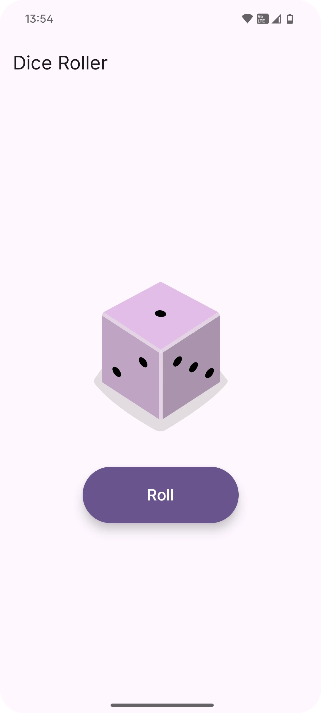

# Dice Roller

Dice Roller is a simple Android application that allows users to roll a virtual dice and see the result. This project is built using Kotlin and Jetpack Compose, following modern Android development practices.

## Features

- **Roll the Dice:** Tap a button to roll the dice and get a random result from 1 to 6.
- **Display Result:** The result of the dice roll is displayed on the screen with a corresponding dice image.
- **Simple UI:** A clean and intuitive user interface built with Jetpack Compose.

## Screenshots



## Built With

- [Kotlin](https://kotlinlang.org/) - The primary programming language for Android development.
- [Jetpack Compose](https://developer.android.com/jetpack/compose) - Android's modern toolkit for building native UI.
- [Android Studio](https://developer.android.com/studio) - The official IDE for Android development.

## Getting Started

To get a local copy up and running, follow these simple steps.

### Prerequisites

- Android Studio Hedgehog or later.
- Gradle 8.0 or later.

### Installation

1. **Clone the repo**
   ```sh
   git clone https://github.com/juliannGabrielDev/DiceRoller.git
   ```
2. **Open in Android Studio**
   - Open Android Studio.
   - Click on `Open` and navigate to the cloned repository folder.
   - Let Android Studio build and sync the project.
3. **Run the app**
   - Select an emulator or a physical device.
   - Click on the `Run` button.

